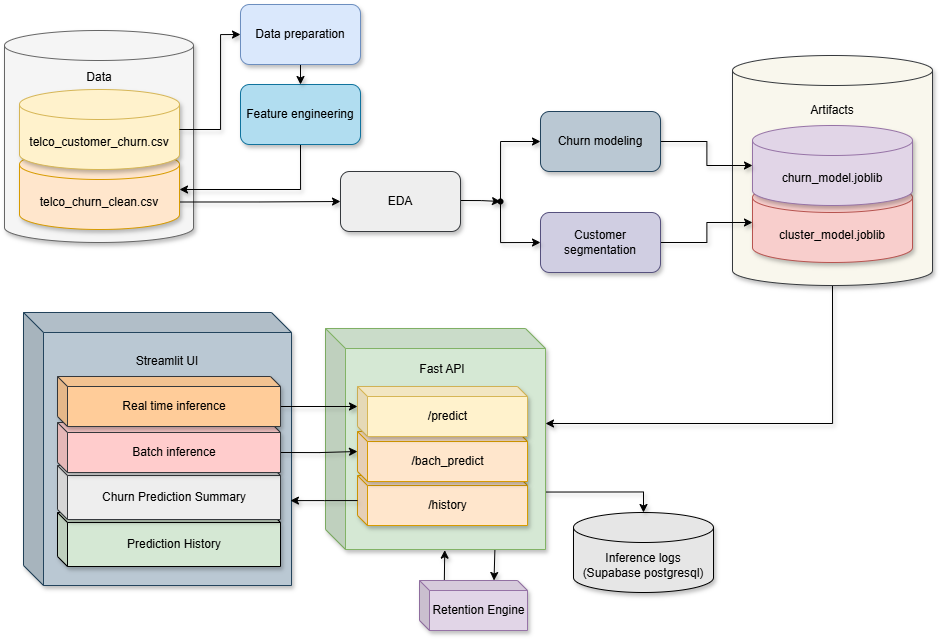

# 📊 Telecom Customer Retention Decision Platform

An end-to-end **Machine Learning Decision Intelligence System** that predicts customer churn, explains *why* customers are at risk, segments users into behavioral personas, and recommends targeted retention actions through a production-style API and interactive dashboard deployed on AWS EC2 — enabling retention campaigns that capture **72.5% of churners while contacting only 35.5% of customers**.

---

## 🚀 Project Overview

Customer churn prediction alone is not sufficient for real business impact.
This system goes beyond prediction by combining:

* **Supervised Learning** → churn risk estimation
* **Customer Segmentation** → behavioral personas
* **Explainable AI (SHAP)** → transparent decision reasoning
* **Decision Rules Engine** → actionable retention strategies
* **API + Dashboard** → real-time operational usage

The result is a **Customer Retention Decision Platform** capable of supporting both real-time and batch customer analysis.

---

## 🧠 Key Capabilities

✅ Predict churn probability for individual customers  
✅ Assign customer personas using behavioral segmentation  
✅ Explain predictions using SHAP feature attribution  
✅ Recommend retention actions automatically  
✅ Perform batch scoring via CSV upload  
✅ Track prediction history and analytics  
✅ Serve models through FastAPI backend  
✅ Interactive analytics dashboard with Streamlit  

---

## 🏗️ System Architecture

```
                 ┌─────────────────────┐
                 │   Streamlit UI      │
                 │  (User Interface)   │
                 └──────────┬──────────┘
                            ↓
                 ┌─────────────────────┐
                 │     FastAPI API     │
                 │   Serving Layer     │
                 │  Docker • AWS EC2   │
                 └──────────┬──────────┘
                            ↓
                 ┌─────────────────────┐
                 │  Retention Engine   │
                 │                     │
                 │ • Churn Model       │
                 │ • Segmentation      │
                 │ • SHAP Explainer    │
                 │ • Action Policies   │
                 └──────────┬──────────┘
                            ↓
                 ┌─────────────────────┐
                 │   PostgreSQL DB     │
                 │ (Supabase-managed)  │
                 │ Prediction Logging  │
                 └─────────────────────┘
```
---



---

## 🔄 End-to-End Workflow

### Offline (Model Development)

```
Raw Dataset
   ↓
Data Preparation
   ↓
Model Training & Evaluation
   ↓
Probability Calibration
   ↓
Threshold Optimization
   ↓
Model Packaging (.joblib)
```

### Online (Production Inference)

```
User Input / CSV Upload
        ↓
FastAPI Endpoint
        ↓
Retention Engine
        ↓
Churn + Persona + Explanation
        ↓
Retention Recommendations
        ↓
Stored in Database + UI Visualization
```

---

## 🤖 Machine Learning Components

### 1. Churn Prediction Model

* Algorithm: **XGBoost (calibrated)**
* Preprocessing:

  * StandardScaler (numeric)
  * OneHotEncoder (categorical)
* Optimized using:

  * Stratified CV
  * Hyperparameter search
  * PR-AUC scoring
* Probability calibration improves business decision thresholds.

---

### 2. Customer Segmentation

* Algorithm: **K-Prototypes**
* Handles mixed numeric + categorical features.
* Produces behavioral personas:

| Cluster | Persona                   |
| ------- | ------------------------- |
| 0       | Premium Loyalist          |
| 1       | High-Risk Price Sensitive |
| 2       | Stable Low-Usage          |
| 3       | Low Engagement Budget     |

---

### 3. Explainable AI

SHAP values provide:

* Top churn drivers
* Feature impact direction
* Transparent model reasoning

---

### 4. Decision Engine

Business logic converts ML outputs into actions:

```
Churn Probability → Urgency Tier
Persona + Urgency → Retention Strategy
```

Example actions:

* Discount offers
* Contract migration
* Customer outreach
* Upsell opportunities

---

## 📊 Model Performance & Business Evaluation

The churn model was evaluated on a held-out test set using calibrated probabilities and business-oriented threshold optimization.

### Model Metrics (Test Set)

| Metric | Value |
|---|---|
| ROC-AUC | 0.831 |
| PR-AUC | 0.610 |
| Recall (Churners Captured) | 0.725 |
| Precision | 0.541 |
| F1 Score | 0.620 |
| Accuracy | 0.764 |

### Business-Oriented Evaluation

Thresholds were selected to optimize retention campaign effectiveness rather than raw accuracy.

Test set summary:

- **Total customers evaluated:** 1,055  
- **Actual churners:** 280 customers (26.5%)

Retention campaign simulation:

- **Customers contacted:** 375 (35.5% of customers)
- **Churners successfully identified:** 203 (72.5% of all churners)
- **Campaign precision:** 54.1% (about 1 in 2 contacted customers were true churn risks)
- **Missed churners:** 77 customers (27.5% of churners not flagged by the model)

This demonstrates a practical trade-off between intervention cost and churn prevention impact, enabling targeted retention efforts instead of contacting the entire customer base.

---

## 📂 Project Structure

```
.
├── app.py                     # Streamlit dashboard
├── src/
│   ├── main.py                # FastAPI application
│   └── retention_engine.py    # Core decision logic
│
├── notebooks/
│   ├── 01_data_preparation.ipynb
│   ├── 02_eda.ipynb
│   ├── 03_churn_pipeline.ipynb
│   ├── 04_shap_analysis.ipynb
│   └── 05_segmentation_pipeline.ipynb
│
├── artifacts/
│   ├── churn_model_package.joblib
│   └── customer_segmentation_package.joblib
│
├── data/
│   ├── raw/
│   └── processed/
│
├── mlruns/                    # MLflow experiment tracking
├── mlflow.db
├── requirements.txt
└── Dockerfile
```

---

## 🌐 API Endpoints

### Predict Single Customer

```
POST /predict
```

Returns:

* churn probability
* urgency level
* persona
* top churn reasons
* recommended actions

---

### Batch Prediction

```
POST /predict_batch
```

Upload CSV → receive scored dataset.

---

### Prediction History

```
GET /history
GET /history_count
```

---

## 📊 Dashboard Features

* Single customer prediction interface
* Batch scoring workflow
* SHAP explanation visualization
* Retention recommendations
* Historical analytics & KPIs

---

## 🧪 Experiment Tracking

MLflow is used for:

* experiment tracking
* model comparison
* metric logging
* artifact versioning

---

## ⚙️ Installation

```bash
git clone https://github.com/ArjunPramodCustomer-Retention-Decision-Platform.git
cd telecom-retention-system

python -m venv .venv
source .venv/bin/activate  # Windows: .venv\Scripts\activate

pip install -r requirements.txt
```

---

## ▶️ Run the System

### Start API

```bash
uvicorn src.main:app --reload
```

### Start Streamlit App

```bash
streamlit run app.py
```

## 🐳 Docker

```bash
docker build -t customer-retention-platform .
docker run --env-file .env -p 8000:8000 -p 8501:8501 customer-retention-platform
```
---

## ☁️ Deployment

The application is deployed on an **AWS EC2 instance** using Docker-based containerization.

Deployment setup:

- FastAPI backend served via Docker container on EC2
- Streamlit dashboard hosted on the same instance
- Supabase used as managed PostgreSQL database
- Environment configuration handled via `.env` variables

Production flow:

User → EC2-hosted API → ML Decision Engine → PostgreSQL Database

---

## 📈 Business Impact

Instead of only predicting churn, this platform enables:

* targeted retention campaigns
* cost-aware intervention strategies
* explainable decision support
* operational ML deployment

---

## 🧩 Tech Stack

* Python
* Scikit-learn
* XGBoost
* K-Prototypes
* SHAP
* FastAPI
* Streamlit
* MLflow
* PostgreSQL
* Docker
* AWS EC2
